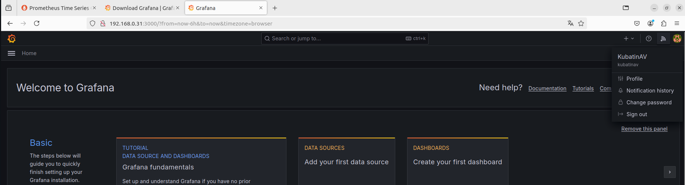

# Домашнее задание к занятию «Система мониторинга Prometheus»

---

### Задание 1
Установите Prometheus.

#### Процесс выполнения
1. Выполняя задание, сверяйтесь с процессом, отражённым в записи лекции
2. Создайте пользователя prometheus
3. Скачайте prometheus и в соответствии с лекцией разместите файлы в целевые директории
4. Создайте сервис как показано на уроке
5. Проверьте что prometheus запускается, останавливается, перезапускается и отображает статус с помощью systemctl

#### Требования к результату
- [ ] Прикрепите к файлу README.md скриншот systemctl status prometheus, где будет написано: prometheus.service — Prometheus Service Netology Lesson 9.4 — [Ваши ФИО]

#### Решение:
1. Создаем пользователя: useradd --no-create-home --shell /bin/false prometheus
2. Скачиваем файл архива wget https://github.com/prometheus/prometheus/releases/download/v3.0.0-rc.0/prometheus-3.0.0-rc.0.linux-amd64.tar.gz
3. Извлекаем из архива tar xvfs prometheus-3.0.0-rc.0.linux-amd64.tar.gz
4. Переходим в папку cd prometheus-3.0.0-rc.0.linux-amd64/
5. Создаем директории mkdir /etc/prometheus и mkdir /var/lib/prometheus
6. копируем cp ./prometheus promtool /usr/local/bin
7. cp -R ./console_libraries/ /etc/prometheus/
8. копируем конфиг cp ./prometheus.yml /etc/prometheus
9. Передаем права пользователю prometeus - chown -R prometheus:prometheus /etc/prometheus/ /var/lib/prometheus/
10. chown prometheus:prometheus /usr/local/bin/prometheus
11. chown prometheus:prometheus /usr/local/bin/promtool
12. Проверяем работу командой /usr/local/bin/prometheus --config.file /etc/prometheus/prometheus.yml --storage.tsdb.path /var/lib/prometheus/ --web.console.templates=/etc/prometheus/consoles --web.console.libraries=/etc/prometheus/console_libraries
Должно быть Server is ready to receive web requests

13. Создаем сервис чтобы прометеус запускался самостоятельно: nano /etc/systemd/system/prometheus
вставляем:
```yaml
[Unit]
Description=Prometheus Service Netology Lesson 9.4 KubatinAV
After=network.target

[Service]
User=prometheus
Group=prometheus
Type=simple
ExecStart=/usr/local/bin/prometheus \
--config.file /etc/prometheus/prometheus.yml \
--storage.tsdb.path /var/lib/prometheus/ \
ExecReload=/bin/kill -HUP $MAINPID
Restart=on-failure

[Install]
WantedBy=multi-user.target
```
14. systemctl enable prometheus.service
15. systemctl start prometheus.service
16. systemctl status prometheus.service
17. Проверяем что директорию принадлежат прометеус
ls - ld /var/lib/prometheus
ls -ld /etc/prometheus
ls -l /etc/prometheus
ls -l /var/lib/prometheus
18. Передаем содержимое прометеусу: sudo chown -R prometheus:prometheus /var/lib/prometheus/
19. пробуем запустить сервис и проверить статус. (команды из пунктов 14 15 16)
20. Видим статус active


---

### Задание 2
Установите Node Exporter.

#### Процесс выполнения
1. Выполняя ДЗ сверяйтесь с процессом отражённым в записи лекции.
3. Скачайте node exporter приведённый в презентации и в соответствии с лекцией разместите файлы в целевые директории
4. Создайте сервис для как показано на уроке
5. Проверьте что node exporter запускается, останавливается, перезапускается и отображает статус с помощью systemctl

#### Требования к результату
- [ ] Прикрепите к файлу README.md скриншот systemctl status node-exporter, где будет написано: node-exporter.service — Node Exporter Netology Lesson 9.4 — [Ваши ФИО]

#### Решение:
1. Идем по адресу https://github.com/prometheus/node_exporter/releases
2. скачиваем node exporter wget https://github.com/prometheus/node_exporter/releases/download/v1.8.2/node_exporter-1.8.2.linux-amd64.tar.gz
3. извлекаем архив tar xvfz node_exporter-1.8.2.linux-amd64.tar.gz
4. Переходим в получившуюся директорию cd ./node_exporter-1.8.2.linux-amd64/
5. пробуем запустить и проверить ./node_exporter затем останавливаем
6. создаем директорию для нод экспортера, копируем его туда и даем права пользователю прометеус, проверяем
mkdir /etc/prometheus/node-exporter
cp ./node_exporter /etc/prometheus/node-exporter
sudo chown prometheus:prometheus /etc/prometheus/node-exporter/node_exporter
ls -l /etc/prometheus/node-exporer
7. создаем сервис
nano /etc/systemd/system/node-exporter.service
вставляем конфиг:
[Unit]
Description=Node Exporter Lesson 9.4 KubatinAV
After=network.target

[Service]
User=prometheus
Group=prometheus
Type=simple
ExecStart=/etc/prometheus/node-exporter/node_exporter

[Install]
WantedBy=multi-user.target

8. Включаем автозапуск и запускаем сервис
systemctl enable node-exporter.service
systemctl start node-exporter.service
systemctl status  node-exporter.service


---

### Задание 3
Подключите Node Exporter к серверу Prometheus.

#### Процесс выполнения
1. Выполняя ДЗ сверяйтесь с процессом отражённым в записи лекции.
2. Отредактируйте prometheus.yaml, добавив в массив таргетов установленный в задании 2 node exporter
3. Перезапустите prometheus
4. Проверьте что он запустился

#### Решение:
1. добавляем энд пойнт в прометеус, чтобы прометеус начал опрашивать с него данные
2. редактируем nano /etc/prometheus/prometheus.yml
добавляем в статик конфиг локалхост 9100
static_configs:
      - targets: ["localhost:9090", "localhost:9100"]
перезапускаем прометеус systemctl restart prometheus.service
3. Проверяем статус systemctl status  prometheus.service
4. идем в веб интерфейс, статус, таргетс


#### Требования к результату
- [ ] Прикрепите к файлу README.md скриншот конфигурации из интерфейса Prometheus вкладки Status > Configuration
- [ ] Прикрепите к файлу README.md скриншот из интерфейса Prometheus вкладки Status > Targets, чтобы было видно минимум два эндпоинта

---
## Дополнительные задания со звёздочкой*
Эти задания дополнительные. Их можно не выполнять. Это не повлияет на зачёт. Вы можете их выполнить, если хотите глубже разобраться в материале.

---

### Задание 4*
Установите Grafana.

#### Требования к результату
- [ ] Прикрепите к файлу README.md скриншот левого нижнего угла интерфейса, чтобы при наведении на иконку пользователя были видны ваши ФИО

#### Решение:
https://grafana.com/
1. установим утилиты sudo apt-get install -y adduser libfontconfig1 musl
2. скачаем пакет wget https://dl.grafana.com/oss/release/grafana_11.3.0_amd64.deb
3. устанавливаем sudo dpkg -i grafana_11.3.0_amd64.deb
4. включаем автозапуск systemctl enable grafana-server.service
5. запускаем systemctl start grafana-server.service
6. проверяем статус sudo systemctl status grafana-server.service
7. идем на айпи машины, порт 3000 http://192.168.0.31:3000/
8. по умолчанию логин пароль admin
9. устанавливаем пароль
10. меняем логин, мой KubatinAV


---

### Задание 5*
Интегрируйте Grafana и Prometheus.

#### Решение:
1. Заходим в connections, add new connection, prometheus (Или через data sources)
2. Прописываем http://localhost:9090
3. Нажимаем save & test
4. 
5. добавим dashboard https://grafana.com/grafana/dashboards/1860-node-exporter-full/
6. копируем идентификатор 1860
7. new, import
8. вставляем id dashboard 1860
9. load, указвыем prometheus источником данных, import
10. получаем готовый dashboard

11. чтобы добавить несколько хостов на дашборд в конфиг файле необходимо добавить еще хостов. 
nano /etc/prometheus/prometheus.yml
static_configs:
      - targets: ["localhost:9090", "localhost:9100"]
Важно, чтобы был установлен тот же самый экспортер. (Другой не подойдет) Когда будет добавлено больше хостов, в списке их можно будет выбирать.